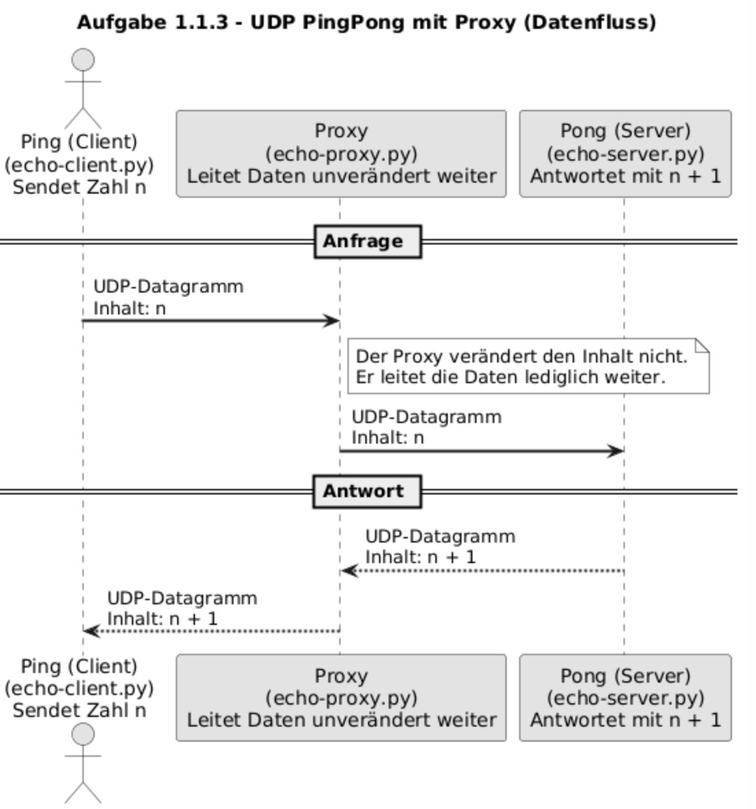

# Aufgabe 1.1.3 – PingPong mit Proxyserver (UDP)

## Zweck der Aufgabe

Diese Aufgabe erweitert die einfache Ping-Pong-Kommunikation (Aufgabe 1.1.1) um einen **Proxyserver**.

- Der **Client (Ping)** sendet eine Zahl `n`
- Der **Proxy** leitet die Nachricht unverändert weiter
- Der **Server (Pong)** antwortet mit `n + 1`
- Die Antwort wird über den Proxy an den Client zurückgeleitet

Der Proxy verändert **keine Daten**, sondern verlängert lediglich den Übertragungsweg.

---

## Datenfluss



---

## Dateien in diesem Ordner

| Datei | Funktion |
|------|---------|
| `echo-client.py` | UDP Client (Ping) |
| `echo-proxy.py` | UDP Proxy (Weiterleitung) |
| `echo-server.py` | UDP Server (Pong) |
| `README.md` | Diese Anleitung |

---

## Voraussetzungen

- Python **3.x** installiert
- Betriebssystem: Windows, Linux oder macOS
- Terminal / Konsole verfügbar
- Alle Dateien befinden sich im **gleichen Ordner**

---

## Port-Konfiguration

| Komponente | Port |
|----------|------|
| Pong (Server) | 5000 |
| Proxy | 5001 |
| Ping (Client) | sendet an 5001 |

---

## Schritt 1: Repository klonen (falls nötig)

```bash
git clone <REPOSITORY-URL>
cd Python-Netzwerktechnik-2025/Python_Code_Beispiele/Luca/1-1-3_Ping_Pong_mit_Proxy
