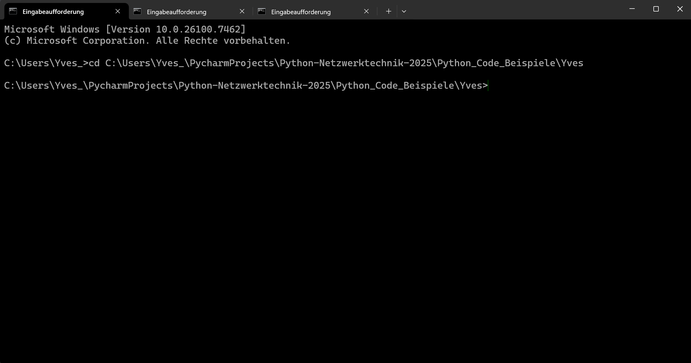
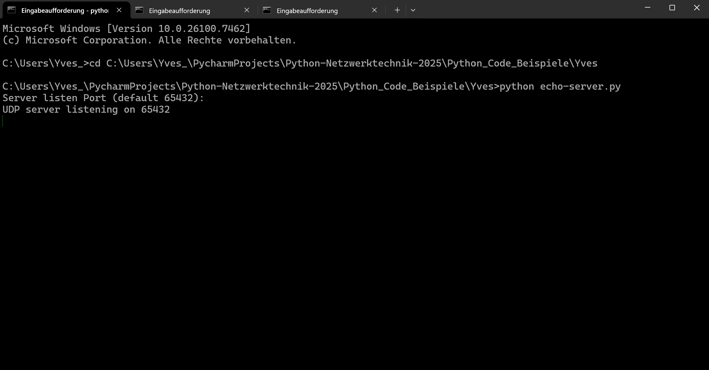
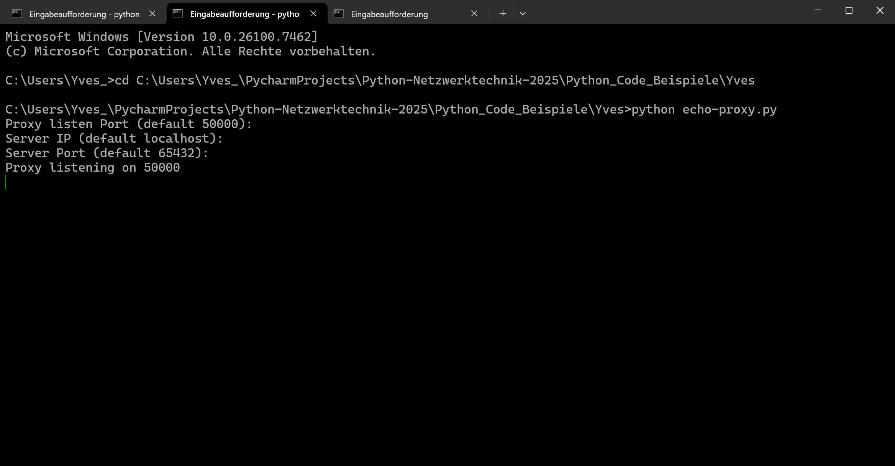
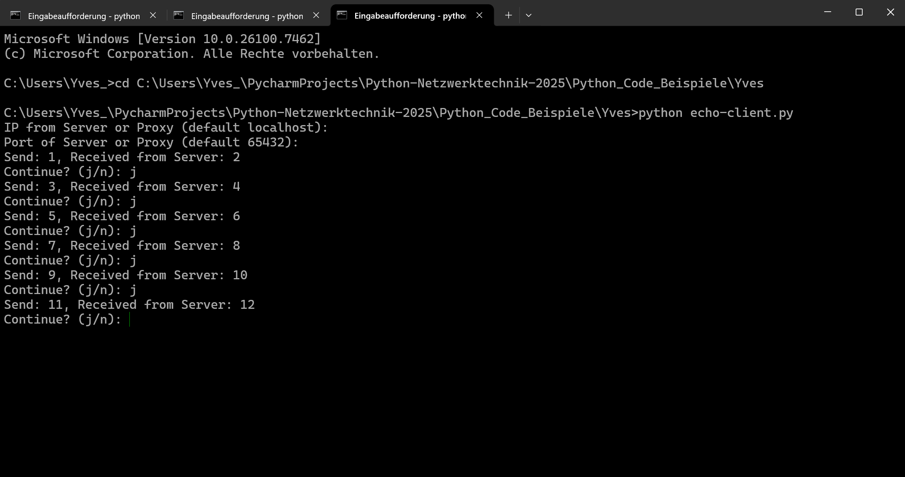

# UDP Ping Pong in Python

## Funktionen
1. echo-client.py sendet eine Zahl z.B. 1
2. echo-proxy.py nimmt Zahl entgegen und leitet diese an echo-server.py weiter
3. Server erhöht die erhalltene Zahl um 1 und sendet diese an den Proxy
4. Proxy leitet die Zahl (z.B. 2) an den Client weiter

## Ablauf
### 1. Terminal öffnen mit 3 Sessions --> Bei jeder Session in den jeweiligen Ordner wechseln mit Befehl cd (Ordner mit "echo-server.py", "echo-proxy.py", "echo-client.py")

    

---

### 2. Mit folgendem Befehl "python echo-server.py" "python echo-proxy.py" "python echo-client.py"

- Der Server: -> Port angeben vom Server (Enter) (ohne Eingabe = Default)
    
    

- Der Proxy: -> Proxy Port angeben (Enter), IP vom Server angeben (Enter), Port vom Server angeben (Enter) (Ohne Eingabe = Default)
    
    

- Der client -> IP vom Server oder vom Proxy angeben (Enter), Port vom Server oder Proxy angeben (Enter), Start Nummer n angeben z.B. 15 (Enter) (Ohne Eingabe = Default vom Server)

    

---

### 3. Nun läuft das Programm und beim echo-client.py kann mann mit J/j immer eine Weitere Zahl senden.

# Dokumentation: UDP Echo-Client, Proxy und Server

## 1. Überblick

Dieses Projekt besteht aus drei Programmen, die gemeinsam ein einfaches Netzwerk-Kommunikationssystem bilden:

- **Echo-Client**
- **Echo-Proxy**
- **Echo-Server**

Alle Programme kommunizieren über das **UDP-Protokoll**. UDP ist ein schnelles, verbindungsloses Netzwerkprotokoll, bei dem keine Garantie besteht, dass Daten vollständig oder in der richtigen Reihenfolge ankommen. Genau deshalb enthält dieses Projekt Mechanismen zur Fehlererkennung.

Das System basiert auf einem einfachen **Zahlen-Ping-Pong-Prinzip**.

---

## 2. Grundidee des Programms

Der Ablauf ist bewusst einfach gehalten:

1. Der Client sendet eine Zahl n an den Server (`direkt oder über den Proxy`)
2. Der Server empfängt die Zahl
3. Der Server antwortet mit der Zahl `n + 1`
4. Der Client prüft, ob die Antwort korrekt ist
5. Der Vorgang kann beliebig oft wiederholt werden

Dieses Prinzip macht Fehler im Netzwerk sofort sichtbar.

---

## 3. Echo-Server

### Aufgabe

Der Echo-Server ist die zentrale Instanz.

- wartet auf eingehende UDP-Nachrichten
- erwartet Zahlen als Daten
- überprüft die Reihenfolge der empfangenen Zahlen
- sendet als Antwort immer die empfangene Zahl `n + 1` zurück

### Funktionsweise

- Beim Start fragt der Server nach dem Port, auf dem er lauschen soll  
  (default: `65432`)
- Der Server bindet sich an alle Netzwerkschnittstellen
- Er wartet dauerhaft auf eingehende Nachrichten (`bekommt nach 60 sek. Timeout Nachricht`)
- Jede empfangene Nachricht wird überprüft:
  - Ist sie eine gültige Zahl (`int`)?
  - Entspricht sie der erwarteten Reihenfolge?
- Anschließend wird die Antwort an den Absender zurückgesendet

### Fehlererkennung

Der Server speichert die zuletzt empfangene Zahl.  
Kommt eine unerwartete Zahl an, wird eine Fehlermeldung ausgegeben.

So lässt sich erkennen:

- verlorene UDP-Pakete
- doppelte Pakete
- falsche Reihenfolgen

---

## 4. Echo-Proxy

### Aufgabe

Der Proxy fungiert als Vermittler zwischen Client und Server.

- empfängt Nachrichten vom Client
- leitet diese an den Server weiter
- empfängt die Antwort vom Server
- sendet die Antwort zurück an den Client

Der Proxy verändert die Daten nicht.

---

### Zweck des Proxys

Der Proxy simuliert reale Netzwerkbedingungen, zum Beispiel:

- zusätzliche Netzwerkgeräte
- Weiterleitungen
- Firewalls oder Router

Dadurch kann überprüft werden, ob die Kommunikation auch über Zwischenstationen korrekt funktioniert.

---

### Besonderheiten

- Der Proxy nutzt ein dauerhaftes UDP-Socket zum Server
- Der Absender-Port bleibt gleich
- Der Proxy verwendet ein Timeout, um nicht unbegrenzt auf den Server zu warten
- Bei fehlender Antwort wird ein Timeout gemeldet

---

## 5. Echo-Client

### Aufgabe

Der Client startet die Kommunikation.

- sendet eine Startzahl `n`
- empfängt die Antwort
- überprüft die Korrektheit der Antwort
- fragt den Benutzer, ob der Vorgang fortgesetzt werden soll

---

### Funktionsweise

- Beim Start gibt der Benutzer an:
  - IP-Adresse von Server oder Proxy (default: `localhost`)
  - Port des Server oder Proxy (default: `65432`)
  - Startzahl (default: `1`)
- Der Client sendet die Zahl per UDP
- Er erwartet als Antwort die Zahl `n + 1`
- Ist die Antwort falsch oder bleibt sie aus, wird das Programm beendet
- Der Benutzer entscheidet, ob ein weiterer Durchlauf erfolgen soll

---

## 6. Zusammenspiel der Programme

### Ohne Proxy

`Client  →  Server  →  Client`

### Mit Proxy

`Client  →  Proxy  →  Server`

`Client  ←  Proxy  ←  Server`

---

## 7. Ziel des Projekts

Dieses Projekt ist ein Lern- und Testsystem und dient dazu:

- Grundlagen der UDP-Kommunikation zu verstehen
- Client-Server-Architekturen kennenzulernen
- Netzwerkprobleme sichtbar zu machen
- Paketverluste und Reihenfolgefehler zu erkennen
- Proxys und Weiterleitungen zu simulieren

Es ist **nicht für den produktiven Einsatz gedacht**.

---

## 8. Zusammenfassung

- Der Client sendet Zahlen und überprüft Antworten
- Der Server verarbeitet Anfragen und überwacht die Reihenfolge
- Der Proxy leitet Nachrichten weiter
- Trotz UDP werden Fehler sichtbar
- Das System ist einfach, aber lehrreich aufgebaut

Das Projekt eignet sich besonders gut zum Lernen von Netzwerkgrundlagen.

